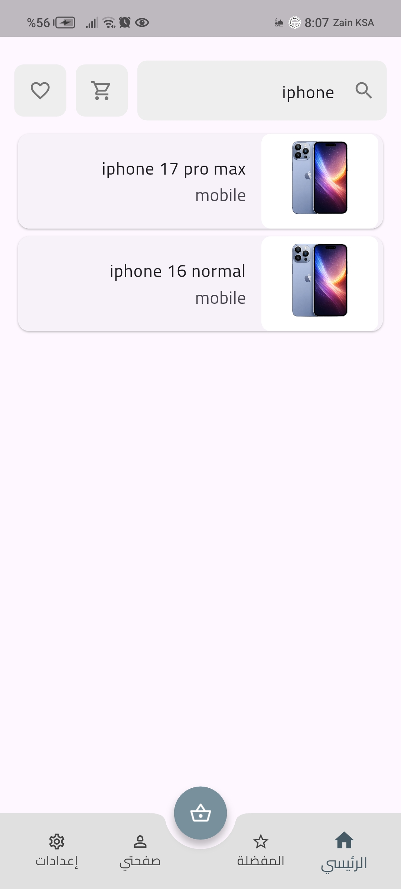
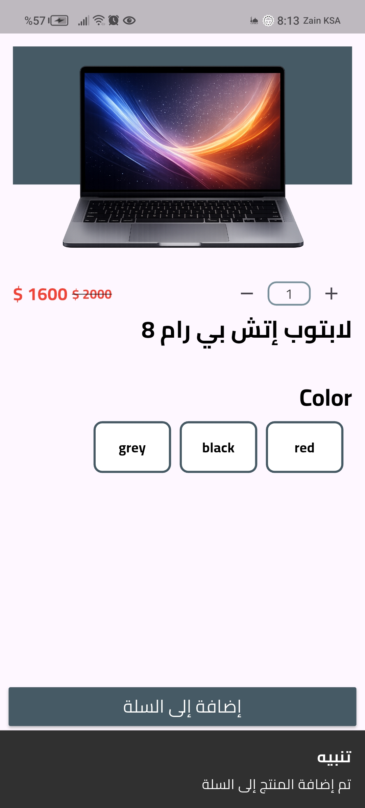
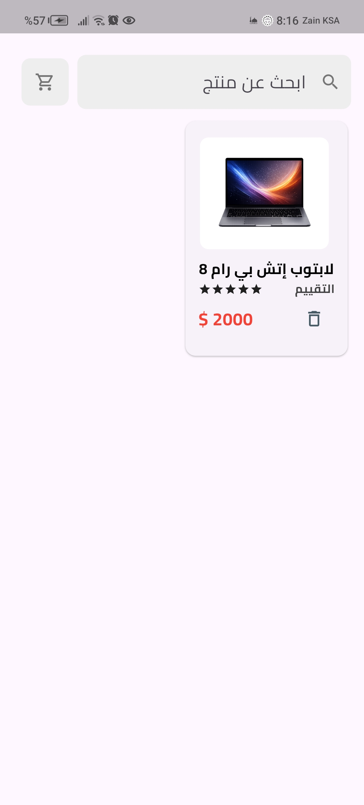
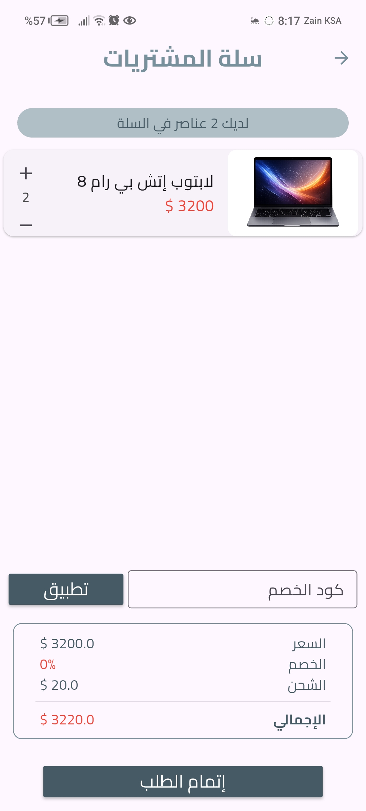
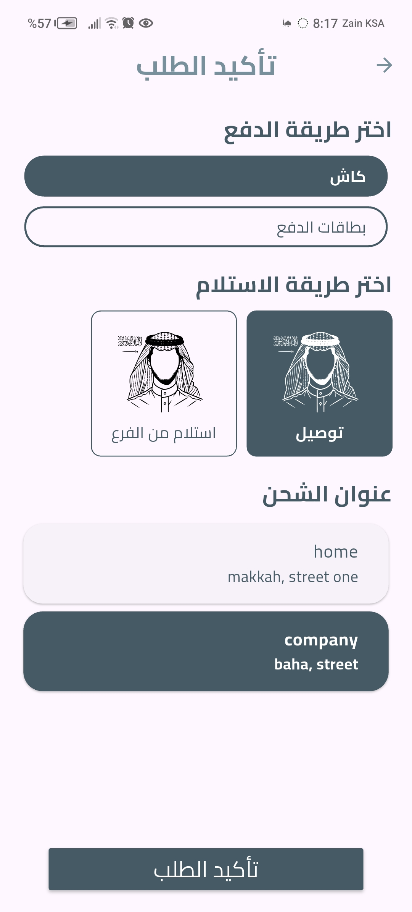
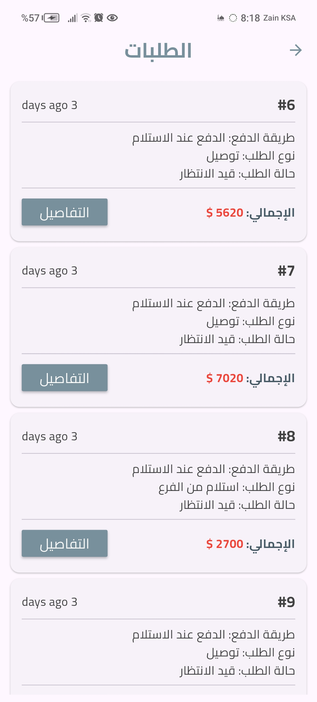
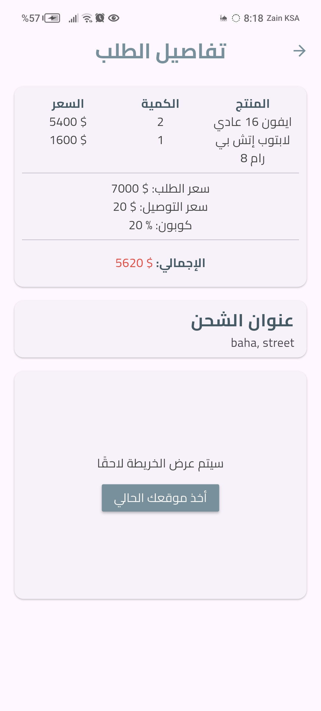
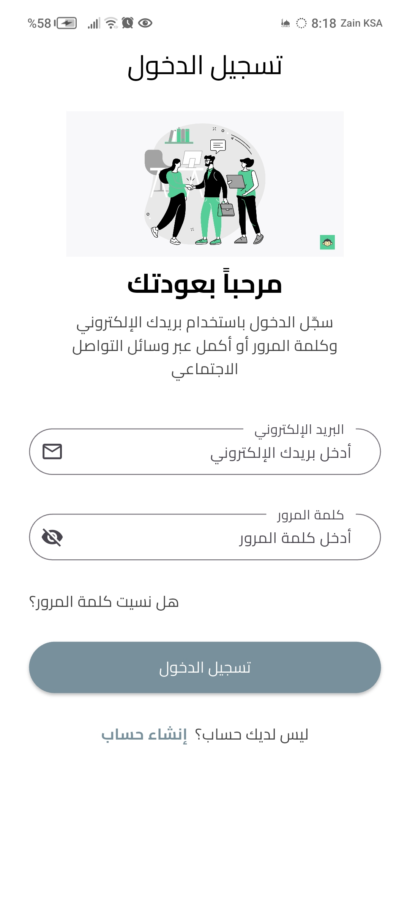

# 📱 Electronics Store App (Flutter + Laravel)

مشروع متجر إلكتروني لتطبيقات الجوال مبني باستخدام **Flutter** للواجهة الأمامية و **Laravel** كخلفية (REST API). المشروع مصمم بأسلوب معماري واضح وقابل للتوسع، ويغطي دورة الطلب كاملة من التصفح حتى إنشاء الطلب.

---

## 🚀 Features

### 🛒 User Side
- تسجيل الدخول / إنشاء حساب
- عرض المنتجات حسب التصنيفات
- البحث عن المنتجات
- صفحة تفاصيل المنتج
- إضافة / حذف من المفضلة (Favorites)
- عربة التسوق (Cart)
- تطبيق كوبونات الخصم
- إدارة العناوين (إضافة / تعديل / حذف)
- إتمام الطلب (Checkout)
- عرض الطلبات (Orders)
- صفحة تفاصيل الطلب (Order Details)

### ⚙️ Backend (Laravel API)
- RESTful API
- مصادقة المستخدمين
- إدارة المنتجات والتصنيفات
- إدارة الطلبات
- نظام الكوبونات
- ربط حقيقي بقاعدة البيانات

---

## 🧠 Architecture & Concepts
- Source of Truth واحد للبيانات
- فصل منطق البيانات عن الواجهة (MVC / Clean-ish Architecture)
- Controllers مستقلة (App Controller / User Controller)
- التعامل الواضح مع الحالات:
  - Loading
  - Success
  - Error / Offline
- عدم تكرار الحالة بين الصفحات
- Navigation منفصل عن منطق البيانات

---

## 🛠️ Tech Stack

### Frontend
- Flutter
- GetX (State Management & Navigation)
- REST API Integration

### Backend
- Laravel
- MySQL
- REST API

---

## 📂 Project Structure (Flutter)
```
lib/
├── core/
├── data/
├── controller/
├── view/
│   ├── screens/
│   └── widgets/
├── routes/
└── main.dart
```

---

### 📱 واجهات التطبيق (App Screenshots)

<table>
  <tr>
    <td align="center"><b>الرئيسية</b></td>
    <td align="center"><b>البحث</b></td>
    <td align="center"><b>تفاصيل المنتج</b></td>
  </tr>
  <tr>
    <td></td>
    <td></td>
    <td></td>
  </tr>
  <tr>
    <td align="center"><b>المفضلة</b></td>
    <td align="center"><b>السلة</b></td>
    <td align="center"><b>إتمام الطلب (Checkout)</b></td>
  </tr>
  <tr>
    <td></td>
    <td></td>
    <td></td>
  </tr>
  <tr>
    <td align="center"><b>طلباتي</b></td>
    <td align="center"><b>تفاصيل الطلب</b></td>
    <td align="center"><b>تسجيل الدخول</b></td>
  </tr>
  <tr>
    <td></td>
    <td></td>
    <td></td>
  </tr>
</table>

---

## 🔧 Setup & Installation

### Backend (Laravel)
```bash
composer install
cp .env.example .env
php artisan key:generate
php artisan migrate
php artisan serve
```

### Frontend (Flutter)
```bash
flutter pub get
flutter run
```

---

## 📌 Notes
- المشروع ما زال قابل للتوسع (Payments / Admin Panel)
- مناسب كنواة منتج حقيقي أو كنموذج Portfolio قوي

---

## 👤 Author
**Badr Abdullah**

- Flutter Developer
- Laravel Backend

---

# 🌍 English Version

## 📱 Electronics Store App

A mobile **e-commerce application** built with **Flutter** as frontend and **Laravel** as backend (REST API). The project follows a clean, scalable architecture and covers the full order lifecycle.

---

## 🚀 Features

- Authentication (Login / Register)
- Product listing & categories
- Product search
- Product details page
- Favorites system
- Shopping cart
- Coupon system
- Address management
- Checkout flow
- Orders & order details

---

## 🧠 Architecture

- Single Source of Truth
- Separation of UI and business logic
- Clean controllers structure
- Explicit state handling (Loading / Success / Error)
- Scalable and maintainable codebase

---

## 🛠️ Tech Stack

- Flutter
- GetX
- Laravel
- MySQL
- REST API

---

## 📌 Status

✅ Actively developed

---

## 📄 License

This project is for learning and portfolio purposes.
